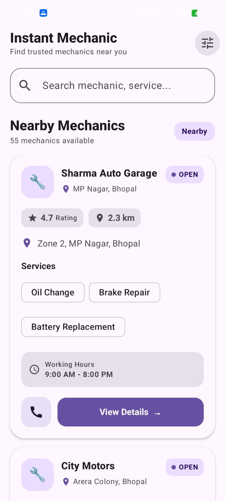
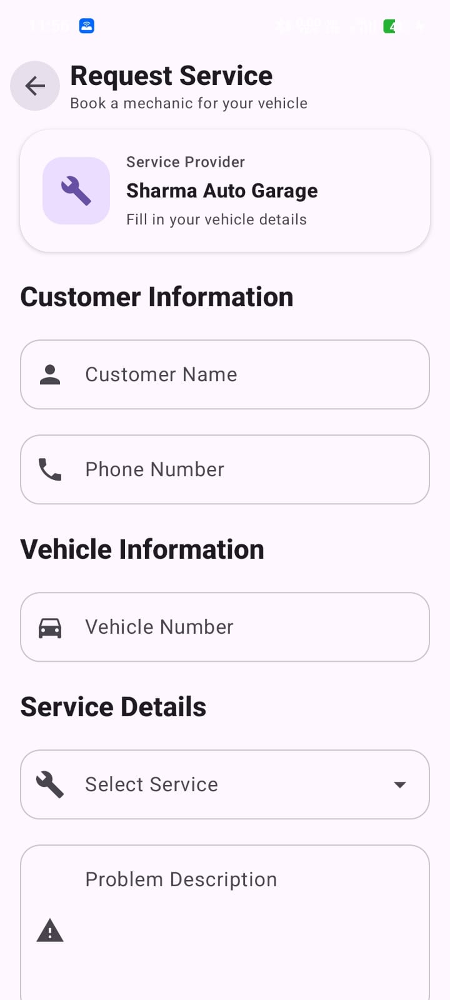

# 🚗 Instant Mechanic

A modern Android application developed as part of the **Instant Mechanic Android Development Internship Assignment**.

Instant Mechanic helps users discover nearby mechanics, view mechanic and garage details, and request vehicle services through a simple and user-friendly mobile application.

---

## 📱 Screenshots

### 🏠 Home Screen

The home screen displays nearby mechanics with their:

- Garage name
- Rating
- Distance
- Location
- Available services
- Open / Closed status
- Working hours
- Search functionality



---

### 🔧 Mechanic Details

Users can select a mechanic and view detailed information including:

- Garage name
- Rating
- Address
- Available services
- Working hours
- Phone number
- Request Service option


---

### 📋 Request Service

Users can submit a service request by providing:

- Customer name
- Phone number
- Vehicle number
- Required service
- Problem description

After submission, the application displays a confirmation screen.



---

# ✨ Features

- 🔎 Search mechanics by name, location, or service
- ⭐ Mechanic ratings
- 📍 Mechanic location and distance
- 🟢 Open / 🔴 Closed status
- 🛠️ Available vehicle services
- 🕒 Working hours
- 📞 Mechanic contact information
- 🔧 Mechanic details screen
- 📋 Service request form
- ✅ Service request confirmation
- 🌐 REST API integration
- 🔄 Loading state
- ⚠️ Error handling
- 🔁 Retry functionality
- 🧩 MVVM architecture
- 💉 Hilt Dependency Injection
- 🎨 Modern Material 3 UI
- 📱 Jetpack Compose
- 🔍 Search functionality

---

# 🛠️ Tech Stack

| Technology | Usage |
|---|---|
| Kotlin | Primary programming language |
| Jetpack Compose | UI development |
| Material 3 | Modern UI components |
| MVVM | Application architecture |
| Retrofit | REST API integration |
| Gson | JSON parsing |
| Kotlin Coroutines | Asynchronous operations |
| StateFlow | UI state management |
| Hilt | Dependency Injection |
| Navigation Compose | Screen navigation |
| Git & GitHub | Version control |

---

# 🏗️ Architecture

The application follows an **MVVM architecture** with a clear separation between UI, business logic, and data layers.

```text
                ┌─────────────────────┐
                │   Jetpack Compose   │
                │         UI          │
                └──────────┬──────────┘
                           │
                           ▼
                ┌─────────────────────┐
                │      ViewModel      │
                │    StateFlow/UI     │
                │       State         │
                └──────────┬──────────┘
                           │
                           ▼
                ┌─────────────────────┐
                │     Repository      │
                │   Data Management   │
                └──────────┬──────────┘
                           │
                           ▼
                ┌─────────────────────┐
                │      Retrofit       │
                │     REST API        │
                └──────────┬──────────┘
                           │
                           ▼
                ┌─────────────────────┐
                │      JSON Data      │
                └─────────────────────┘
```

---

# 📂 Project Structure

```text
com.manage.services.instantmechanic
│
├── data
│   ├── local
│   │
│   ├── model
│   │   ├── Mechanic.kt
│   │   └── ServiceRequest.kt
│   │
│   ├── remote
│   │   └── MechanicApi.kt
│   │
│   └── repository
│       └── MechanicRepository.kt
│
├── navigation
│   └── AppNavigation.kt
│
├── presentation
│   ├── home
│   │   ├── HomeScreen.kt
│   │   ├── HomeUiState.kt
│   │   └── HomeViewModel.kt
│   │
│   ├── details
│   │   └── MechanicDetailsScreen.kt
│   │
│   └── request
│       └── RequestServiceScreen.kt
│
├── ui.theme
│
├── InstantMechanicApplication.kt
└── MainActivity.kt
```

---

# 🌐 REST API Integration

The application uses a mock REST API to retrieve mechanic information.

### Base URL

```text
https://dummyjson.com/
```

### Endpoint

```text
GET /c/a860-6359-4537-bb91
```

### Complete API URL

```text
https://dummyjson.com/c/a860-6359-4537-bb91
```

The API returns mechanic information in JSON format.

Retrofit is used for network communication and Gson is used to convert the JSON response into Kotlin data classes.

### Retrofit API Interface

```kotlin
interface MechanicApi {

    @GET("c/a860-6359-4537-bb91")
    suspend fun getMechanics(): List<Mechanic>
}
```

---

# 📡 API Data Flow

```text
REST API
   ↓
JSON Response
   ↓
Retrofit
   ↓
Gson Converter
   ↓
Mechanic Data Model
   ↓
Repository
   ↓
ViewModel
   ↓
StateFlow
   ↓
Jetpack Compose UI
```

---

# 🔄 Loading & Error Handling

The application handles different API states:

### Loading State

While mechanic data is being fetched, a loading indicator is displayed.

```text
Loading
   ↓
Circular Progress Indicator
```

### Success State

When the API request succeeds, mechanic information is displayed on the Home Screen.

### Error State

If the API request fails, the application displays an error message and provides a **Retry** button.

```text
API Error
   ↓
Something went wrong
   ↓
Retry
```

---

# 🔍 Search

The Home Screen provides search functionality.

Users can search mechanics using:

- Mechanic / garage name
- Location
- Available service

For example:

```text
Oil Change
```

can display mechanics offering oil-change services.

---

# 🔧 Mechanic Details

When a user selects a mechanic, the application displays detailed information.

The details screen contains:

- Garage name
- Rating
- Address
- Location
- Services
- Working hours
- Phone number
- Request Service button

---

# 📋 Request Service

Users can request a vehicle service by filling out the service form.

### Form Fields

```text
Customer Name
Phone Number
Vehicle Number
Select Service
Problem Description
```

The submit button becomes available when the required fields are completed.

After successful submission, a confirmation screen is displayed.

---

# 💉 Dependency Injection

The application uses **Hilt** for dependency injection.

Hilt is used to provide dependencies such as:

- Retrofit
- MechanicApi
- MechanicRepository
- ViewModel dependencies

This reduces manual object creation and makes the architecture easier to maintain and test.

---

# ⚙️ Setup & Installation

## 1. Clone the Repository

```bash
git clone YOUR_GITHUB_REPOSITORY_URL
```

Replace:

```text
YOUR_GITHUB_REPOSITORY_URL
```

with the actual GitHub repository URL.

---

## 2. Open the Project

Open the project in **Android Studio**.

Allow Gradle to sync and download the required dependencies.

---

## 3. Configure JDK

Use:

```text
JDK 17
```

---

## 4. Connect Android Device / Emulator

Connect an Android device or start an Android Emulator.

---

## 5. Run the Application

Click:

```text
Run ▶
```

The application will build and launch on the selected device.

---

# 🌐 Internet Permission

The application uses a REST API, so Internet permission is required.

Add the following inside `AndroidManifest.xml`:

```xml
<uses-permission android:name="android.permission.INTERNET" />
```

---

# 📦 Dependencies

The major libraries used in this project include:

```text
Jetpack Compose
Material 3
Navigation Compose
Retrofit
Gson
Kotlin Coroutines
StateFlow
Hilt
Lifecycle ViewModel
```

---

# 🧠 Assumptions

- Mechanic data is provided through a mock REST API.
- Mechanic distance is represented using mock data.
- Mechanic availability is represented using mock data.
- Service request submission demonstrates the required confirmation flow.
- No real payment functionality is required.
- No real-time mechanic tracking is required.
- The application focuses on the mechanic discovery and service request workflow.

---

# 🚀 Additional Features

The following additional features were implemented beyond the basic requirements:

- 🔎 Search functionality
- 📍 Location-based mechanic search
- 🛠️ Service-based search
- 🔄 Retry after API failure
- 💉 Hilt Dependency Injection
- 🧩 MVVM architecture
- 🎨 Material 3 UI
- 📱 Jetpack Compose interface
- 🔄 State-based UI
- ⚠️ Loading and Error states
- ✅ Service request confirmation

---

# 📋 Assignment Requirement Coverage

| Requirement | Status |
|---|---|
| Home Screen | ✅ |
| Mechanic List | ✅ |
| Garage Name | ✅ |
| Rating | ✅ |
| Distance | ✅ |
| Location | ✅ |
| Available Services | ✅ |
| Open / Closed Status | ✅ |
| Mechanic Details | ✅ |
| Address | ✅ |
| Working Hours | ✅ |
| Phone Number | ✅ |
| Request Service Form | ✅ |
| Customer Name | ✅ |
| Phone Number | ✅ |
| Vehicle Number | ✅ |
| Service Selection | ✅ |
| Problem Description | ✅ |
| Request Confirmation | ✅ |
| REST API Integration | ✅ |
| JSON Parsing | ✅ |
| Loading State | ✅ |
| Error Handling | ✅ |
| API Data Display | ✅ |
| Kotlin | ✅ |
| Jetpack Compose | ✅ |
| MVVM | ✅ |
| Search / Filter | ✅ |
| Dependency Injection | ✅ |
| Good UI/UX | ✅ |

---

# 📸 Screenshot Files

The following screenshots are included in the repository:

```text
Home_Screen.jpeg
Mahenic_Details.jpeg
Request_Services.jpeg
```

> Make sure these three image files remain in the **same root directory as README.md**.

---

# 🔮 Future Improvements

Possible future improvements include:

- Firebase Authentication
- Real mechanic registration
- Real-time booking status
- Google Maps integration
- GPS-based distance calculation
- Push notifications
- Online payment
- Mechanic-side application
- Service request history
- Offline caching with Room
- Pagination for large mechanic lists

---

# 👨‍💻 Developer

## Sonu Kumar Singh

**Native Android Developer**

### Skills

```text
Kotlin
Jetpack Compose
Android Development
MVVM
Retrofit
Firebase
Room
Coroutines
Flow
Hilt
Kotlin Multiplatform
```

---

# ⭐ Project

This project was developed as part of the **Instant Mechanic Android Development Internship Assignment**.

The project demonstrates practical implementation of:

- Modern Android development
- Kotlin
- Jetpack Compose
- REST API integration
- JSON parsing
- MVVM architecture
- Dependency Injection
- State management
- Error handling
- Search functionality
- Service request workflow
- Modern UI/UX

---

## ⭐ Thank You

Thank you for reviewing the **Instant Mechanic** Android application.
